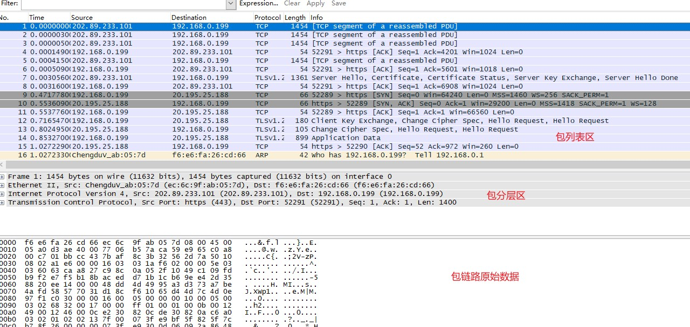
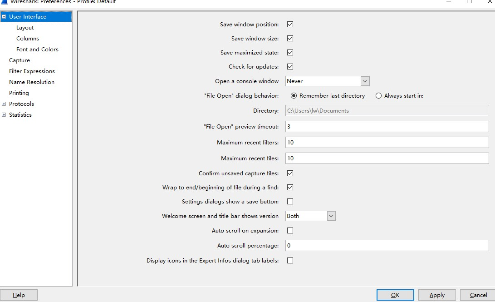
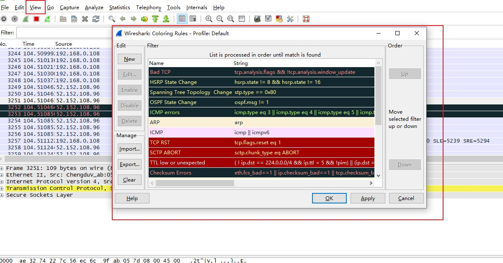

## wireshark简史
>最初的版本叫Ethereal,由毕业于密苏里大学堪萨斯城分校计算机专业的
>Gerald Combs出于项目需要开发，于1998年以【GPL】开源许可证发布,在发布8年之后，
>Combs另谋高就，但那个时候他的公司掌握了商标权，于是Combs的整个团队在2006年将这个项目
>重命名为Wireshark

### Wireshark的优点：

1.支持的协议：

   - 已经超过850种协议支持；
   - 你也可以通过自己编写的代码提供相应的支持，并提供给Wireshark开发者

2.用户友好度：

   - Wireshark提供了GUI界面，布局简洁，支持协议间的色彩区分

3.价格：

   - Wireshark是开源项目，一款免费的自由软件

4.程序支持：

   - Wireshark开源社区很活跃，提供了许多的网页链接，包括在线文档、支持与开发WIKI、
FAQ...[Wireshark官网](https://www.wireshark.org/)

5.支持的平台：

   - Wireshark对主流的操作平台都提供了支持，包括Windows、Mac OS、Linux,可以在Wireshark主页上面查询

### 安装Wireshark:

   1.400MHz以上的CPU；

   2.128MB的内存

   3.至少75MB的可用存储空间

   4.支持混杂模式的网卡

   5.WinPcap驱动

   >winpcap驱动是windows对于pcap数据包捕获的通用程序接口(API)的实现，简单来说就是这个驱动能够通过操作系统捕获原始的数据包，能够让网卡切入或切出混杂模式
   

### 首次捕获：

   1. open wireshark
   2. 在菜单栏中选着capture,然后选择对应的interface
   3. 点击start
   4. 开始捕获

### Wireshark主窗口：

   如下图所示： 
 
   

### Wireshark Preference:

   

   >Wireshark提供了一些首选项设定，可以根据需要进行定制

   1. User Interface:
   
      - 此选项决定了Wireshark将如何显示数据，主要分为6个部分
      - Capture可以让你对捕获数据包方式进行特殊的设定
      - Printing选项可以让你对打印的数据进行各种特殊的设定
      - Name Resolutions，通过设定，可以解析成更加容易分辨的名字
      - Statistics，提供统计一些功能
      - Protocols，这一部分与捕获和显示各种Wireshark能够解析的数据包有关，只有一部分协议提供相关配置
   
###Data packet 色彩显示：
   > wireshark色彩设置主要有助于快速识别不同的协议，可以在wireshark的view 菜单栏中设定,在编辑着色过滤器时，前景色和背景色都可以修改。
   
