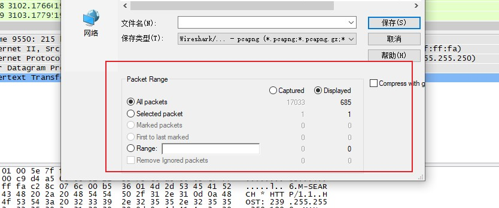
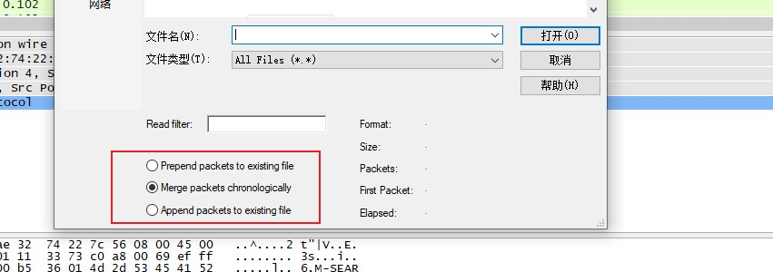
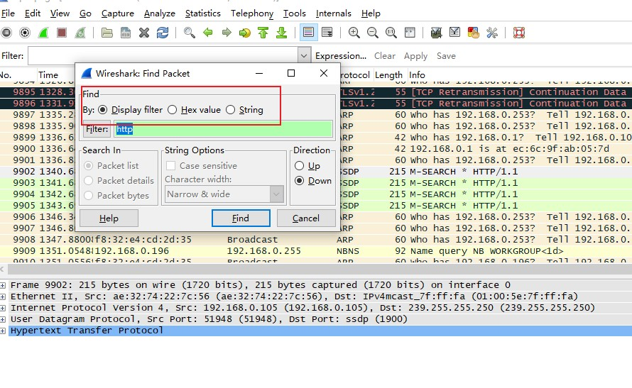
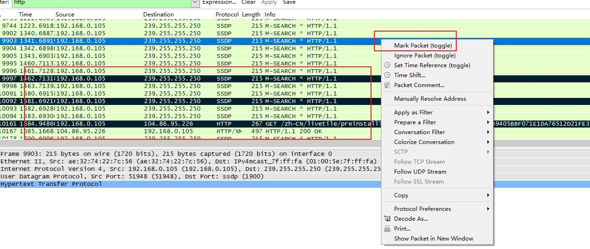
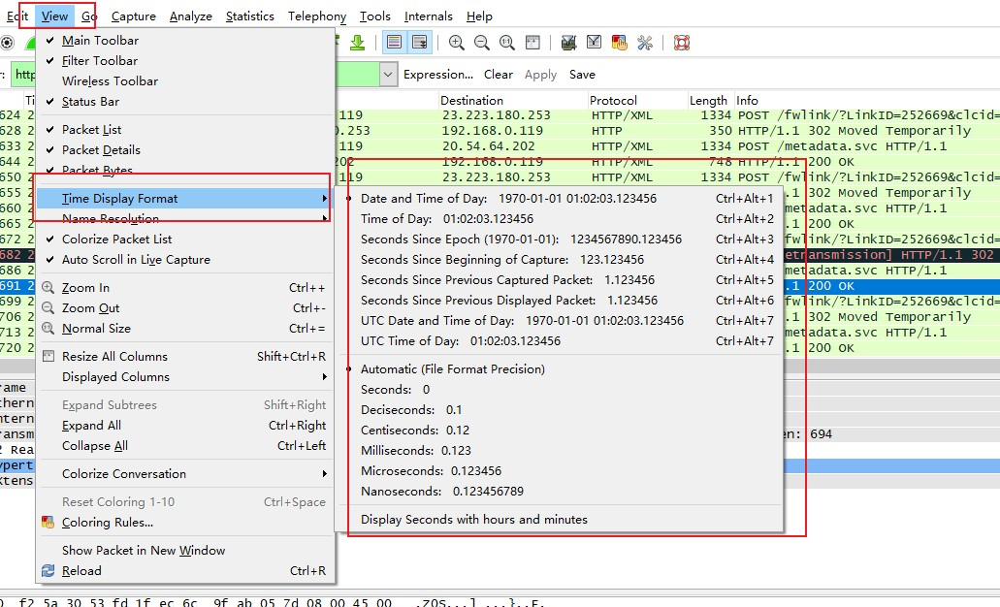
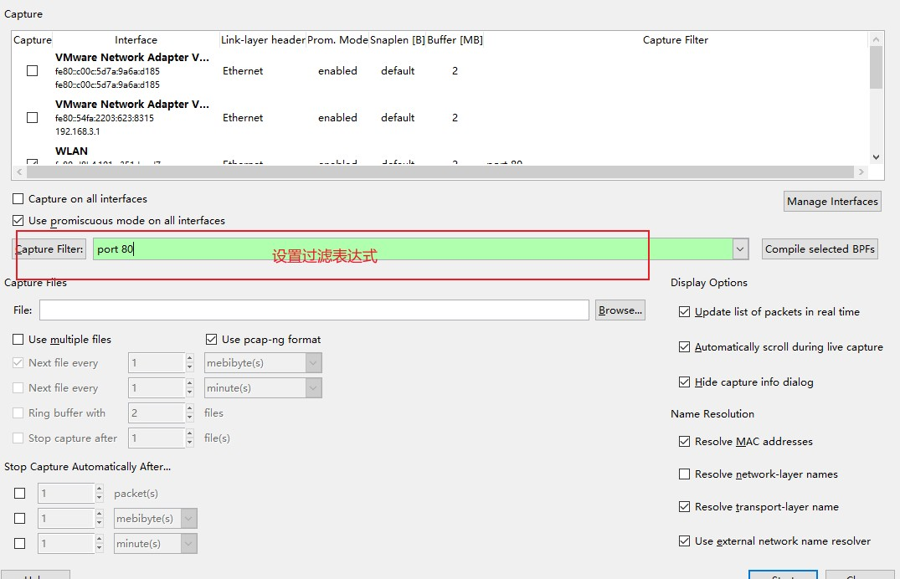
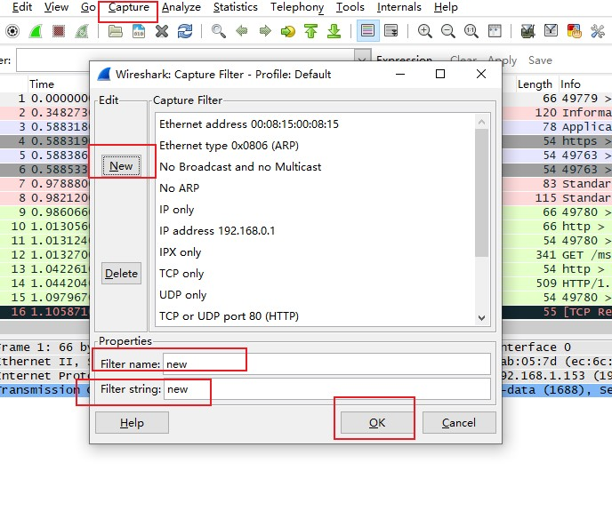
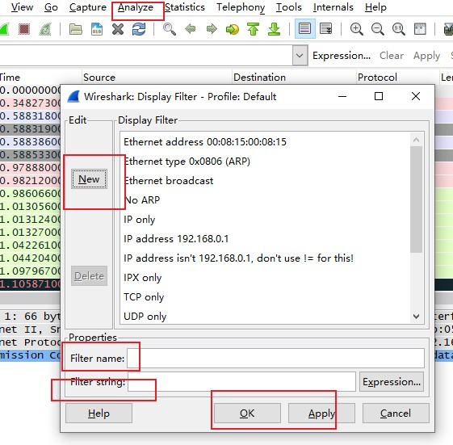

##数据包处理

>主要包括学习使用捕获文件、分析数据包、时间显示格式

###使用捕获文件：

   1. 保存数据包：
   > 在File>Sava As中，Save AS面板提供了强大的功能，可以选择只保存一定序号范围的数据包、标记的数据包、过滤器筛选后显示的数据包。

   2. 导出数据包：
   > 在File>Export中，提供了几种导出格式，以便在其它工具中查看。包括文本文件、PostScript、逗号分隔值(CSV)、XML
   
   

   3.合并数据包：
   > 一些类型分析工作需要合并多个数据包文件，一般在比较两个数据流或者合并单独捕获的同一数据流的时候运用。合并用法：首先打开一个需要合并的文件，然后选择File>Merge，弹出对话框；然后就可以选择合并方式（合并到当前文件前/后/按时间进行合并)
   
   

###分析数据包：
   >数据包成千上万，你需要更高效的处理数据包，Wireshark可以将一些数据包进行标记，
   
   1. 查找数据包
   > 如果要查找符合特定条件的数据包，按Ctrl+F打开Find Packet(Display filter通过输入表达式进行筛选、Hex value通过输入十六进制进行筛选、String通过字符串进行筛选)Ctrl+N(查找下一个匹配的数据包)、Ctrl+B(查找前一个匹配数据包)如下图：
   
   

   2.标记数据包

   >标记数据包：右击Packet list，选择Mark Packet；或者在在Packet list选择一个数据包，然后按Ctrl+M,取消同键。如果想在做标记的数据包前后切换，可以按Shift+Ctrl+N/Shift+Ctrl+B.
   
   

   3 .数据包时间设置 

   >包括时间显示格式与相对时间，当为一个数据包设置为相对时间参考时，这个数据包的Time列会显示*REF
   
  

  
  
  4.设定捕获选项
  
  > 通过Capture->Options选项打开，包括：Capture、Capture Files、Stop Capture、Display Options、Name Resolutions五个部分
  
   - 捕获设定
   
    可以选择对应接口，Capture Filter选项可以让你指定一个捕获过滤器
    
   - 捕获文件设定
   
     Cpature File部分可以自动将捕获的数据包直接存储到文件当中。增加了灵活性，可以存储为单个文件或者文件集，如果想开启，需要在File文本框中输入文件路径和文件名；当所捕获的文件流量很大时，使用文件集就有优势，这里需要勾选Multiple File.Wireshark基于文件大小、时间条件等各种触发器对文件集进行管理，这些选项也可进行组合。 Ring Buffer With可以使你环状缓冲创建一个文件集，运用了FIFO算法，

   - 停止捕获选项

     Stop Capture After选项可以让你在一定数目文件被创建之后停止当前捕获。

   - 显示选项
   
     Display 部分可以用来控制数据包如何进行显示， Update List of Packets in Real Time:实时更新数据包列表，Automatic Scrolling in Live Captrue；在当前捕获中进行滚动。此两项对处理器消耗较大，除非你一定要实时查看数据包，否则最好关掉这两项。

   - 名字解析选项
   
     Name Resolution可以在捕获时自动启动数据链路层、网络层、传输层的名字解析

5 . 过滤器使用
    
   > Wireshark主要提供两种过滤器。捕获过滤器：进行捕获时，只有那些满足表达式的数据包会捕获；显示过滤器：用于在一个已经捕获的数据包集合中。
   

   - 捕获过滤器：
    
     当处理大量数据时，可以创建自定义的捕获过滤器。具体步骤：Capture-->Option-->选择进行捕获数据包的对应设备-->在Cpature Filter输入过滤语法-->点击Start开始捕获。捕获使用BPF语法(Berkeley Packet Filter),此语法被大量数据包嗅探器使用，主要原因就是依赖使用BPF的libpcap/Winpcap库。使用BPF语法创建的过滤器叫做表达式，每个表达式至少包含一个原语，每个原语包含至少一个限定词，后面跟着ID或数字.限定词：Type(指出名字或数字所代表意义，例如：host、net、port);Dir(指明传输方向是前往还是来自名字或数字,例如：src、dst);Proto(限定匹配的协议)

     可以使用3种逻辑运算符对原语进行组合(&&、||、！)

     

     5.2 主机名和地址过滤器(关注一个或一些特定的网络设备，可以根据设备的MAC、IP地址、DNS配置过滤)

	 - 根据ipv4过滤：host 172.16.16.149;根据ipv6过滤:host 2001:bd8::7334
	 - 基于一台设备主机名host过滤：host testservers
	 - 如果考虑到IP地址经常发生变化，可以通过ether协议来对MAC地址进行过滤：ether host 00-98-12-sd-ds-ds
	 - 通过传输方向来过滤：src/det host 172.12.12.123
	
     5.3 端口和协议过滤器(对每个数据包的端口进行过滤，通过用来过滤使用已知端口的服务和应用)

     - 例如：port 80(对80端口进行过滤)
     - !port 80(对80以外的端口进行过滤)
     - 经常和传输方向一起使用。dst port 80(只过滤80端口的服务)
     
     5.4 协议过滤器

     协议过滤器可以让你基于特定协议进行数据包过滤，通常被用于那些不是应用层的不能简单使用特定端口进行定义的协议。例如查看ICMP协议：icmp

     5.5 协议域过滤器

     > 可以通过协议间的字节来创建过滤器，从而可以匹配一个数据包从某个特定的位置开始一定数量的字节。协议后面在方括号里面的数字是协议里面字节偏移量，这样将返回字节进行比较过滤。例如：icmp[0] == 3(基于icmp的类型域进行过滤，icmp类型域刚好在协议首个字节-->0的位子，3代表目标不可到达的信息)。可以在方括号偏移值的后面以冒号隔加一个字节长度，来指定返回的字节长度。例如：icmp[0:2] == 0x0301(返回两个字节，与十六进制0301(类型3、代码1)进行比较).----当一个字节包含多个标志时，不能只通过偏移量进行过滤，必须在原语后面加入一个单一的&符号，来指定希望检查这个字节的比特位置(例如过滤TCP设置了PSH标志[比特位代表数值为8]tcp[13]&8==8[位置和值都是二进制转换成十进制])。

    5.5 显示过滤器

    > 显示过滤器用来对捕获文件过滤，可以在Packet List面板上方Filter输入一个表达式

     + 在过滤器表达式对话框，可以方便的创建捕获和显示过滤器。在Capture Option-->Capture Filter-->Expression.左边列出了所有的协议域。创建步骤如下:单击协议旁的加号，找到你所要使用的那一项条件---->选择你想在条件域和条件值之间建立的关系[大于、小于、等于]---->输入一个条件域相关的条件值---->点击OK

     + 表达式语法结构。比较操作符可以让你进行值的比较[例如：frame.len<=128].逻辑运算符可以让多个过滤器表达式合并到一起[and、or、xor(有且仅有一个条件符合)、not(没有条件被满足)]

     5.6 保存过滤器

     + 自定义捕获过滤器，Capture-->Capture Filters-->点击New，创建一个新的过滤器-->Filter Name给一个过滤器名字-->Filter String给一个表达式-->save
     
     

     + 自定义显示过滤器，Analyze-->Display Filter-->点击左侧New-->Filter Name给一个过滤器名字-->Filter String给一个过滤器表达式-->save

     