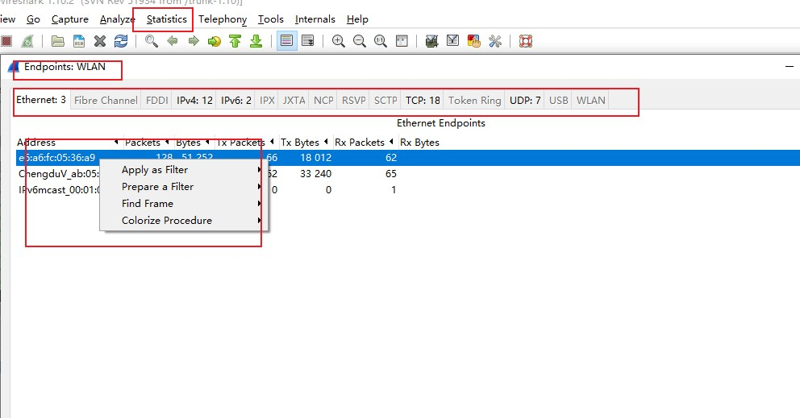
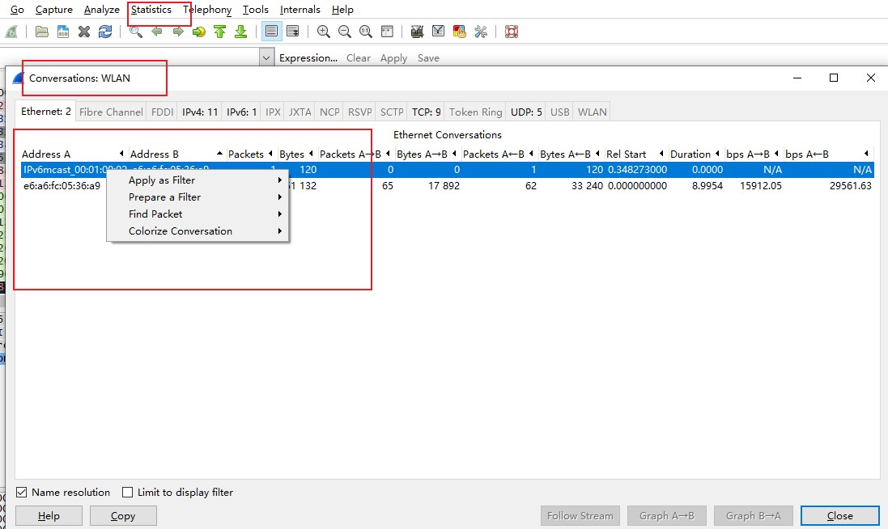
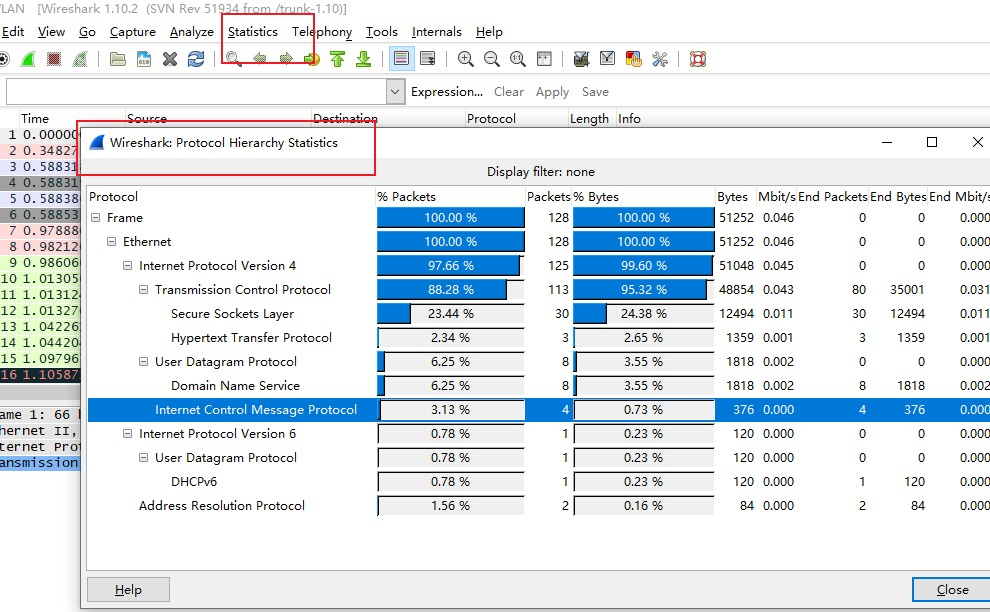
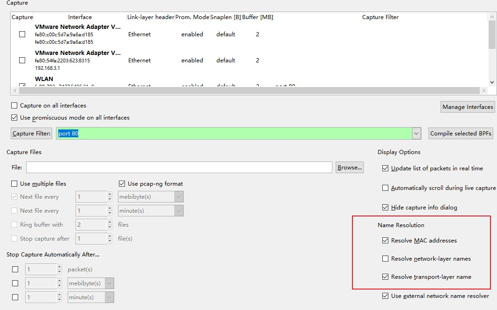
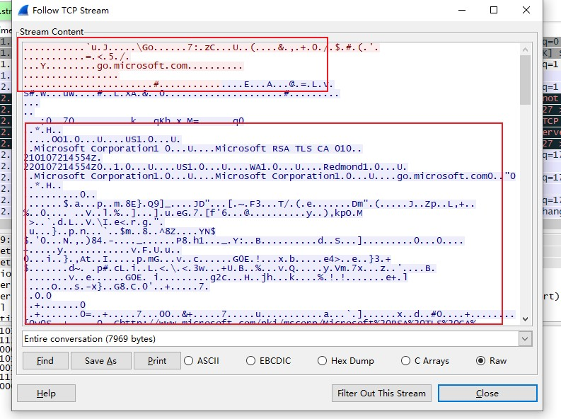
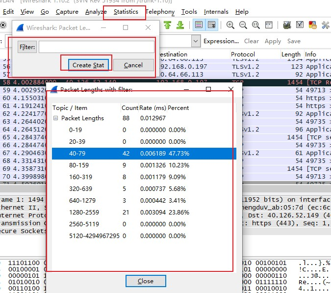
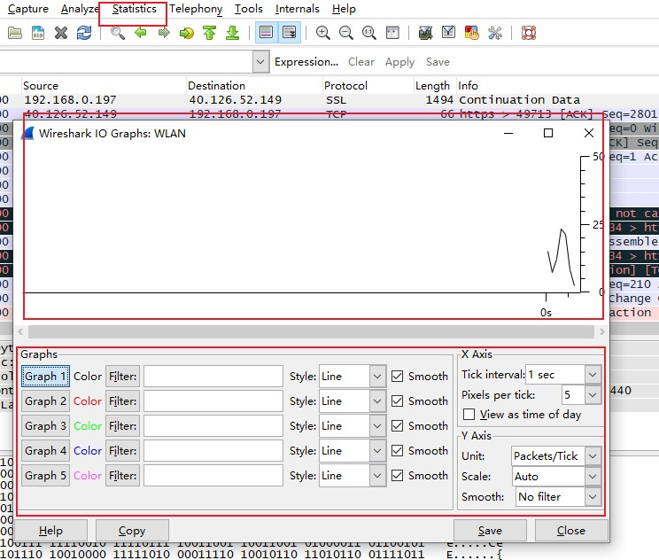
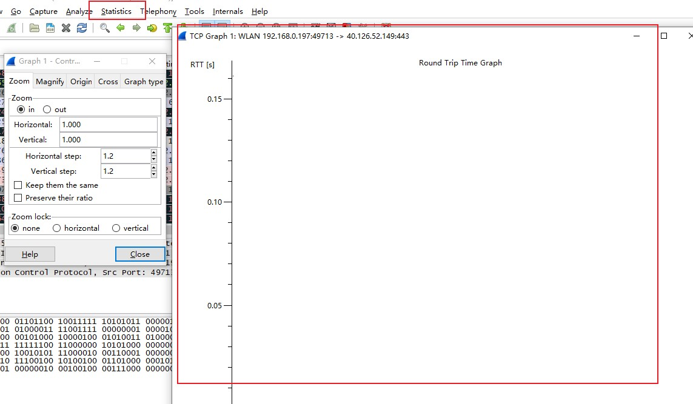
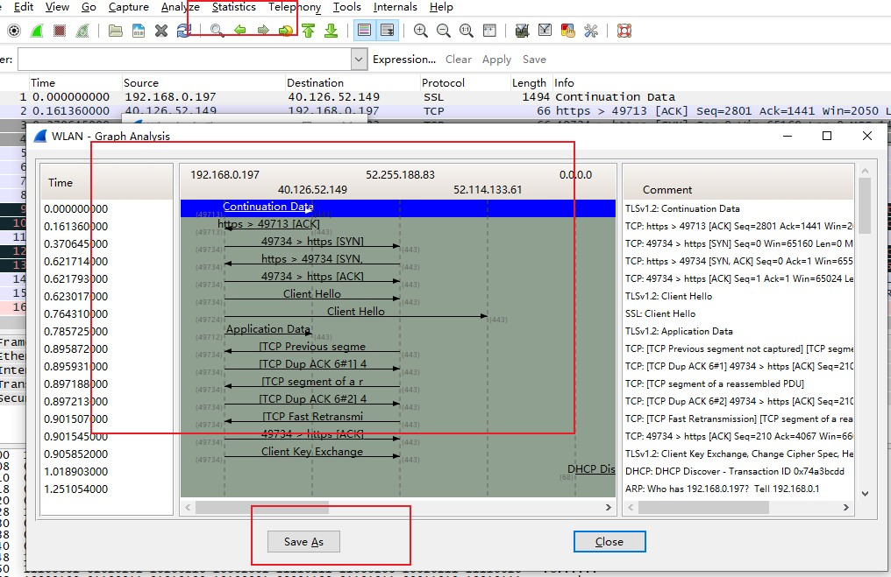
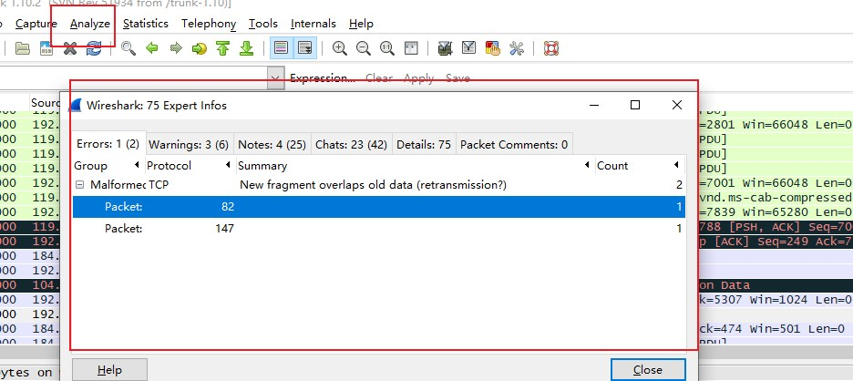

##Wireshark高级特性
 >主要包括分析和图形化功能[**端点和会话窗口、名字解析、协议解析、数据流跟踪、图形化**]

###1.网络端点和会话

   > 端点[endpoint]就是指网络中能够发送和接收数据的设备，网络[conversation]中会话就如端点到端点的交流

   1. 查看端点
   
   > Wireshark的EndPoints(**Statistics-->Endpoint**)给出了每一个端点许多有用统计数据，窗口顶部给出了选项卡，勾选Name Resolution,可以在窗口开启名字解析功能。右击端点，可以过滤出对应端点的数据包，显示在Packet List面板上。

   

   2.查看网络会话

   > Wireshark会话窗[**Statistics Conversation**],以Address A 和地址Address B显示了会话中端点的地址

   
   

   3.端点和会话进行问题定位

   > 在网络问题分析中十分重要，可以精准的找到网络中大规模流量源头。

   4.基于协议分层的数据统计

   > 当分析特别大的捕获文件时，有时需要分析文件各个协议的分布情况。Wireshark的Protocol Hierarchy Statistics是对协议分布了解的工具。Statistics-->Protocol Hierarchy(会注意到所有比例加在一起并不是百分之百，是因为很多数据包包含着不同的分层的协议，从而按照协议计算与按照数据包计算是有一些差异，但还是可以得到协议分布情况)

   

   5.名字解析

   + 开启名字解析：**Capture-->Options**,有3类名字解析：MAC地址解析【MAC name resolution】:使用ARP协议将链路层地址转换成网络层地址，如果失败，Wireshark会使用程序目录中ethers文件尝试进行解析，Wireshark最后的就是将MAC地址前3个字节转换到设备IEEE指定的制造商名称

   + 网络地址解析【Network name resolution】，将一个网络层IP地址转换成一个易读的DNS域名

   + 传输名字解析【Transport name resolution】,尝试将一个端口号转换成一个与其相关的名字，例如:将端口80转换成http

   

   5.1 名字解析的弊端

   + 当所查询的名字服务器不知道这个名字时，解析可能失败

   + 名字解析数据不会随着文件一起保存，每次打开文件都要重新进行一次。也意味着当一个文件解析所使用的服务器不可用时，解析会失败

   + 解析DNS名字时，会产生额外的数据包，也就是说你所捕获的文件流量可能被那些解析DNS名字流量所占据，而在分析问题时，避免看自己的流量是一个典型的规则

   + 名字解析会带来额外的开销，当内存很少时，可能需要关闭名字解析来节约资源

   6.协议解析器

   > Wireshark的协议解析器可以将数据包拆分成多个多个协议区段。例如ICMP协议解析器可以把原始数据解析成ICMP格式数据包。Wireshark对每一个原始数据包都会采用多个解析器，或者用内部的编写逻辑进行合理的猜测。

   6.1

   > Wireshark在给每个数据包选择解析器时，不是每一次都会正确。特别当网络中的一个协议使用了不同标准的配置。为了解决这个问题，可以强制Wireshark采用特定解析器进行解析，这个过程被称为强制解码。具体步骤如下：**右击一个数据包-->Decode As-->选择一个想要使用的解析器(destination transport)**.注意：在强制解码产生的更改，并不会随着文件的保存而保存，每次打开都会进行重新解码。Wireshark-->Decode As-->Show Current可以显示到当前为止所有进行的强制编码操作

   6.2 查看解析器源码

   > 在Wireshark的Develop链接中，点击Browse the Code可以查看，进入releases可以查看Wireshark所有版本包括ethereal，在epan/dissectors可以找到解析器【packets-protocolname.c数据包-协议名.c】来命名

   7 . 跟踪TCP流

   > Wireshark可以将TCP流重新组装成容易阅读的格式，在查看HTTP、FTP等纯文本协议非常好。打开方式：**右击一个HTTP、TCP数据包-->选择Follow TCP Stream**里面颜色以那方开始通信为准，红色表示源地址，蓝色表示目的地址。除了看原始数据，还可以文本搜索、保存、打印、以及不同的编码显示

   

   8.数据包长度

   > 一个数据包或一组，数据包可以反映很多情况，以太网数据帧最大1518字节，出去2、3、4层头部，还剩下1460可供应用层头部和数据使用，具体查看步骤如下：**statistics-->packet lengths-->creat stat**.查看数据包长度可以概览整个文件情况，如果存在很多较大的数据包，很可能是进行数据传输，如果绝大多数数据包很小，可以假设这个捕获中存在协议控制命令，而没有传输数据数据包

   

   9.图形分析

       9.1 查看IO图

   > Wireshark的IO图可以对网络吞吐量进行绘制，利用这些可以找到吞吐量的峰值，找出不同协议的性能差异。具体操作步骤如下:**点击任意一个数据包-->Statistics-->IO Graphs**,就可以看见一个端点的数据吞吐量。对话框下面有5个过滤器，可以选着指定的数据流量，并以颜色区分，可以更容易区分不同流量类型的吞吐量情况。

   

       9.2 双向时间图
 
   > round-trip time,RTT[双向时间]，双向时间就是你的数据包抵达到目的地和这个数据包抵达所发送的确认返回到你的时间之和。利用双向时间可以分析通讯的慢点和瓶颈，以确定是否存在延迟。具体操作如下：**选择一个数据包-->Statistics-->Tcp Stram Graph-->Round-trip time Graph**图中的每一个点都代表一个数据包的双向时间，可以单击任意一个点，并在Packet List查看具体的数据包。

   

       9.3 数据流图

   > 数据流图可以将连接可视化，一般一列的形式将端点之间的连接显示出来，并将流量组织在一起。具体操作如下：**Statistics-->Flow Graph**一些简单的选项用于处理数据包以及数据流的类型。

   

   10.专家信息

   > Wireshark中的每一个协议都有一些专家信息，可以让你得到使用这些协议的数据包一些特定状态的警告。主要分为4类：**对话[关于通信的基本信息]；注意【正常通信中的异常数据包】；警告【不是正常通信的数据包】；错误【数据包中的错误，或者解析器解析时的错误】**具体操作如下：Analyze-->Expert info composite

   