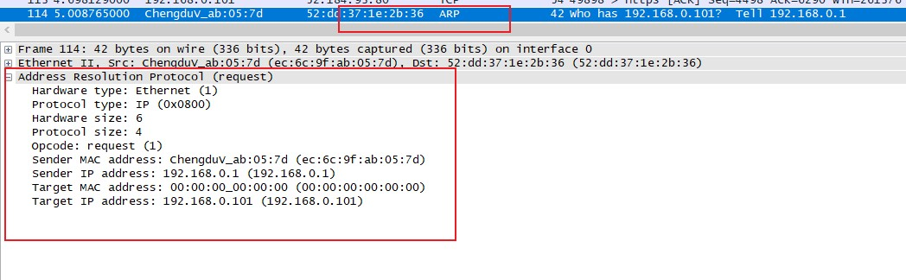
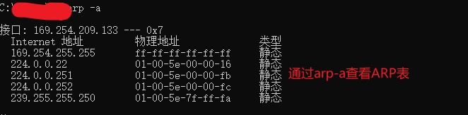
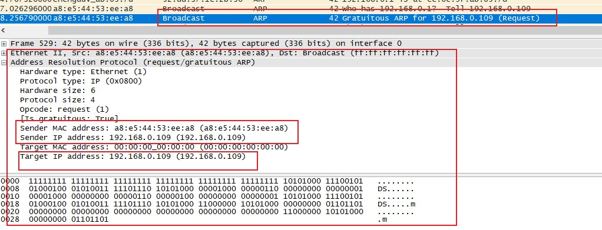

## 通信底层协议

> 将介绍几种常见的协议，包括TCP、UDP、IP、HTTP、DHCP、DNS等

### 地址解析协议

> 网络交互通常使用两种地址：逻辑地址与物理地址,逻辑地址可以使不同网络联通，物理地址可以使同一网段设备交互.TCP/IP网络(基于IPV4)中将IP地址解析为MAC地址过程称为地址解析协议(Address Resolution Protocol--ARP],它的解析过程只使用两种数据包,请求包和响应包.RFC(Request for Comments)是定义协议实现的标准官方文档,可以在RFC Editor的首页搜索[RFC文档](http://www.rfc-editor.org/)。在Windows下可以通过命令arp-a来查看ARP表

#### ARP头 
  - hardware type[硬件类型]：数据链路层使用的类型，大多数下是以太网
  - protocol type[协议类型]：ARP请求使用的高层协议
  - hardware size[硬件地址长度]：正在使用的硬件地址长度
  - protocol size[协议地址长度]：对于指定协议类型所使用的逻辑地址
  - opcode[操作]：操作码，1表示请求、2表示请求
  - ip/mac address[地址]：发送或接收方的地址

#### 无偿ARP
> 在多数情况下，网络端点的IP地址是可能发生变化的，此时网络中端点的IP与MAC地址映射就不再生效，为了防止这种情况发生，无偿的ARP请求会发送到网络中，强制所有收到它的设备去更新映射关系。
数据包的特点：发送地址和目标地址都是相同的。

