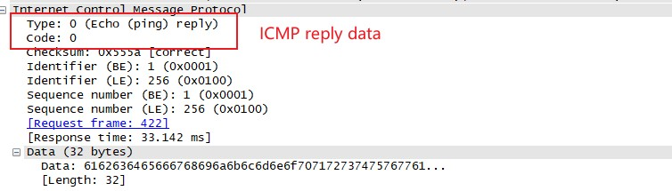

## 通信底层协议

> 将介绍几种常见的协议，包括TCP、UDP、IP、HTTP、DHCP、DNS等

### 地址解析协议

> 网络交互通常使用两种地址：逻辑地址与物理地址,逻辑地址可以使不同网络联通，物理地址可以使同一网段设备交互.TCP/IP网络(基于IPV4)中将IP地址解析为MAC地址过程称为地址解析协议(Address Resolution Protocol--ARP],它的解析过程只使用两种数据包,请求包和响应包.RFC(Request for Comments)是定义协议实现的标准官方文档,可以在RFC Editor的首页搜索[RFC文档](http://www.rfc-editor.org/)。在Windows下可以通过命令arp-a来查看ARP表

#### ARP头 
  - hardware type[硬件类型]：数据链路层使用的类型，大多数下是以太网
  - protocol type[协议类型]：ARP请求使用的高层协议
  - hardware size[硬件地址长度]：正在使用的硬件地址长度
  - protocol size[协议地址长度]：对于指定协议类型所使用的逻辑地址
  - opcode[操作]：操作码，1表示请求、2表示请求
  - ip/mac address[地址]：发送或接收方的地址

#### 无偿ARP
> 在多数情况下，网络端点的IP地址是可能发生变化的，此时网络中端点的IP与MAC地址映射就不再生效，为了防止这种情况发生，无偿的ARP请求会发送到网络中，强制所有收到它的设备去更新映射关系。
数据包的特点：发送地址和目标地址都是相同的。

#### 互联网协议

> 位于OSI模型的第三层协议，主要目的是实现不同网络间能够互联通信。MAC地址实现第二层网络通信。

1. IPv4头

> 源IP地址与目的IP地址是组成IPv4数据包头中的重要组成部分，但IPv4头部域还包括一些额外的信息：

  + 版本号[Version]:IP所使用的版本
  + 首部长度[header Length]:IP头长度
  + 服务类型[Type of Service]；优先级标识和服务类型标志位，被路由器用来流量优先处理的依据
  + 总长度[Total Length]:IP头和数据包的总长度
  + 标识符[identification]:一个唯一的标识数字，用于识别一个数据包或数据分片的次序
  + 标记[Flags]:用来标记一个数据包是否是一组分片数据包的一部分
  + 分片偏移[Fragment Offset]:一个数据包是一个分片，用来将数据包以正确的顺序组装
  + 存活时间[Time to Live]:用来定义数据包的生存时间，以路由器跳数进行描述
  + 协议[Protocol]:用来定义上层协议
  + 源目IP[Source/Destination IP]:定义发送方于接收方
  + 选项[Options]:保留作额外的IP选项，包含源站选路和时间戳一些选项
  + 数据[Data]:使用IP传输的实际数据

  

  > 存活时间定以该数据包在被丢弃之前，所经历的时间或能够经过的最大的路由数目，通常每经过一跳值减【1】，存活时间主要防止网络上出现环路。IP数据包分片用于解决跨越不同类型的网络，一个数据分片主要基于链路层的最大传输单元【Maximum Transmission Unit,MTU】,以太网的最大传输单元是1500字节【不包括自身14字节头部】。数据包分片步骤如下：

  - 设备将数据包分为若干个可以成功传输的数据包分片
  - 每个ip头的总长度域会设置为每个分片的分片长度
  - 更多分片标志将会在数据流的所有包中设置为【1】，除了最后一个数据包
  - IP头部的分片偏移将会被设置
  - 发送

  > 被分片的数据包要么有大于0的偏移量，要么有设定了更多分片的标志。

  2.传输控制协议

  > 传输控制协议【Transmission Control Protocol】,最终目的就是为端到端提供一个可靠的传输，TCP头如下：

  - 源目端口[Source\Destintion Port]:定义发送接收端口
  - 序号[Sequence Number]:表示一个TCP片段，用来保证数据流中的部分没有缺失
  - 确认号[Acknowledgment Number]:定义希望从远端设备得到的下一个数据包序号
  - 标记[Flags]:URG、ACK、PSH、RST、SYN、FIN都是用来表示TCP数据包类型
  - 窗口大小[Windows size]:TCP接收者缓冲的大小
  - 校验和[Checksum]：用于验证TCP头和数据域在抵达目的地时内容完整
  - 紧急指针[Urgent Pointer]:如果设置了URG，这个域将被检查作为额外的指令，告诉CPU从哪里开始读取数据
  - 选项[Options]:各种可选的域，可在TCP域中进行指定

  > TCP端口，**标准端口【1-1023】，临时端口【1024-65535】**.[通用端口列表](http://www.iana.org/assignments/port-numbers/)。TCP三次握手的目的如下：

  - 保证源主机确定目的端点在线，并且可以进行通信
  - 源端点检查目的是否正在监听试图去链接的端口
  - 允许源端点向接收者发送起始序号，使得两端可以将数据包保持有序的传输
 
  > 握手的主要过程**A端点向B端点发送一个TCP数据包(带有SYN标志与起始序号)---->B端点向A端点回复一个数据包(包括SYN\ACK标志与起始序号)---->A端点向B端点返回一个带有ACK标志的数据包**

  
  > TCP终止,用来正常结束两台设备链接，这个过程包含4个数据包，并且用一个带FIN的标志来表明链接的终止。主要过程如下：**端点A向端点B发送一个带FIN\ACK标志的数据包-->端点B回复一个带ACK标志的响应包-->端点B并传送自己的FIN\ACK数据包-->端点A向端点B回复一个带ACK标志的响应包**

  > TCP重置,RST标志用来指出链接被异常终止或拒绝链接请求，RST数据包除了包含RST和ACK标志外，没有任何其它的东西，之后也没有额外的通信

  

  3.用户数据报协议

  > User Datagram Protocol(DUP).TCP是为了提供可靠传输，UDP是为了提供快速不可靠传输
  > 一种尽力服务，通常依赖的UDP协议都会有其内置可靠性服务。例如：DNS、DHCP需要高度依赖数据包端点速度型，使用UDP作为它们的传输层，它们自己能进行错误检测，可靠传输。
  
  UDP头
 
  + 源目端口
  + 数据包长度
  + 校验和
  
  

  4.互联网控制消息协议
  > Internet Control Message Protocol ICMP,负责提供TCP/IP网络设备、服务以及路由器可用性信息，大多数网络检修工具都是基于常用的ICMP信息

 ICMP头(icmp头相对较小并根据用途改变)

  + 类型(Type):ICMP消息基于RFC规范的类型或分类
  + 代码(Code):消息基于RFC规范的子类型
  + 校验和(CheckSum):保证头部与数据信息完整
  + 可变域(Variable):依赖类型与代码的部分

  ICMP类型与代码
  > ICMP数据包结构取决于Type、Code域中的值所定义类型。可以将ICMP的Type域作为数据包的分类，Code作为它的子类。[ICMP类型站点](http://www.iana.org/assignments/icmp-parameters)

  Echo请求与响应

  > ICMP因ping工具名声大噪，ping用来检测一个设备的可连接性。使用方法:**ping ip address**,如果目标在线，数据包达到目的端点并且没有防火墙隔离通信，就可以看到响应数据包。现在防火墙都会限制设备去响应icmp数据包，增强安全性，、但这样查找问题也会变得困难。ping实际是一个工具名称，echo是ping工具发送的一个ICMP数据包。可以使用Ping的选项，增加它的数据填充，这样在检测不同类型网络类型是，强制分片，在检测分片较小的网络时会用到。**ICMP请求使用的随机文本，攻击者可能会有这段填充来推测设备所使用的操作系统，并且攻击者可能在这个域中放置一些数据作为反向链接的手段**

  

  

  路由跟踪

  > 路由跟踪功能来识别一个设备到另一个设备的路径。ICMP类型11，代码0，就是数据包的TTL值在传输时超时，目标不可到达。ICMP对应的响应头被叫做双头包，因为ICMP的结尾部分包含原先的echo请求IP头和ICMP数据拷贝，这个信息在检修时非常有用。路由跟踪要与路径上的每一个路由器进行通信，从而发出整个路由图。在讨论的路由跟踪主要时基于Windows，因为只有它在使用ICMP，Linux上的路由跟踪更复杂，并使用其它的协议来跟踪。

  

  

  