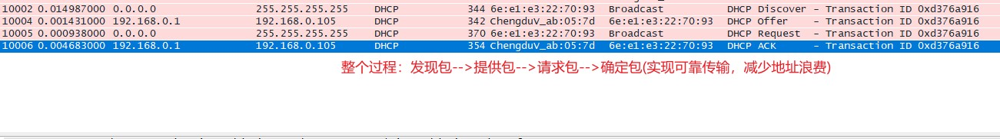
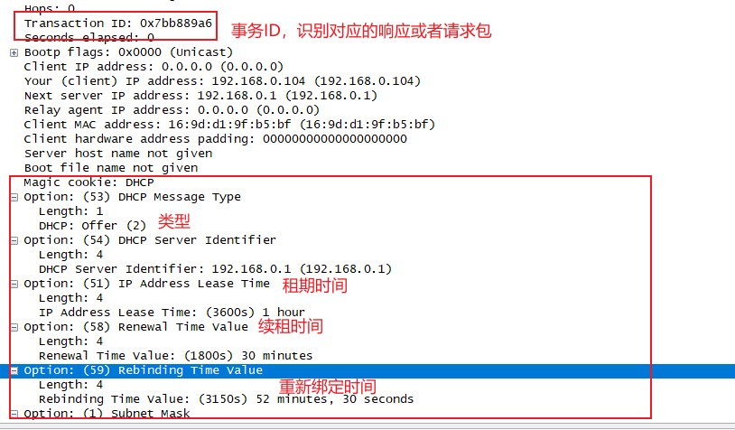
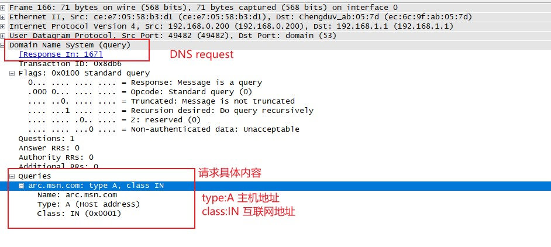
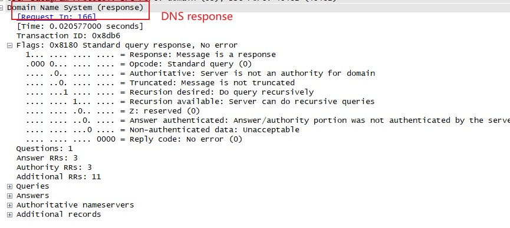
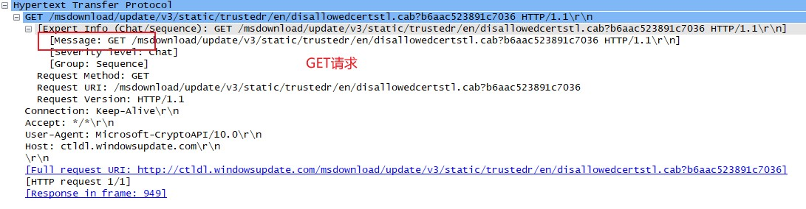
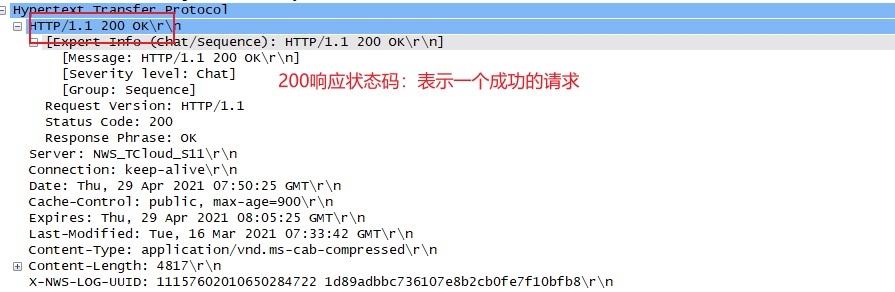

## 常见高层协议：

> 将介绍DHCP、DNS、HTTP协议

#### 动态主机配置协议DHCP

> 为了改善早期手动配置地址的繁琐，BOOTP协议(BootStrap Protocol)被创建出来实现自动给设备分配地址。BOOTP之后被更加复杂的动态主机配置协议(Dynammic Host Configuration Protocol)所取代。

###### DHCP头部结构

> DHCP协议为客户端带来许多信息，包括IP地址、DNS、网关......

+ 操作代码(OpCode):用来区分请求还是回复包
+ 硬件类型(Hardware Type):硬件地址类型(以太网、IEEE802、ATM......)
+ 硬件长度(Hardware Length):硬件地址长度
+ 跳数(Hops):中继代理用来帮助寻找DHCP服务器
+ 事务ID(Transaction ID):用来匹配请求和响应的随机数
+ 消耗时间(Seconds Elasped):客户端第一次向DHCP服务器请求后的时间
+ 标记(Flags):DHCP客户端能接受的流量类型(单播、广播......)
+ 源目IP地址
+ 网关IP地址
+ 客户端硬件地址(Client Hardware Address):客户端MAC地址
+ 服务器主机名(Server Host Name):服务器主机名，可选
+ 启动文件(Boot File):DHCP所使用的启动文件，可选
+ 选项(Options):对DHCP数据包进行扩展，以提供更多的功能

###### DHCP续租过程

> DHCP的主要过程就是在续租过程向客户端分配IP地址。续租过程通常称作DORA，4种DHCP数据包：发现【Discover】-->提供【Offer】-->请求【Request】-->确认【Acknowledgement】

+ 发现数据包

> 第一个发现包是从0.0.0.0 的68端口发往255.255.255.255的67端口。由于Wireshark在处理DHCP时，任然引用BOOTP，所以看到的任然是BootStrap Protocol,而不是DHCP

+ 提供数据包

> ip头中列出了可用的IP地址，显示是从服务端地址前往一个指定的地址。此时客户端实际不具备地址，所以服务端首先尝试使用由ARP提供的客户端MAC地址与之通信。如果失败，就直接广播出去，进行通信。主要提供信息如下：

+ 请求数据包

> 客户端在接收一个offer包之后，将以一个DHCP请求包作为接收确定。此时源地址任然是**0.0.0.0**，因为还没有完全获取IP地址，所请求的数据包不在为空。

+ 确认数据包

> 这一步就是DHCP在确认数据包中给客户端发送其请求的IP地址，并在其数据库记录相关信息。

DHCP选项和消息内容

> DHCP依赖可选项提供真正的灵活性，数据包的真正大小则取决于所使用的选项。[DHCP选项列表](http://www.iana.org/assignments/bootp-dhcp-parameter).DHCP数据包都需要的唯一选项就是消息类型选项，这个标志标识着客户端或服务端将怎样处理数据包中的信息。常见的类型如下：**1-->发现；2-->提供；3-->请求；4-->拒绝【客户端向服务器指明数据包的无效参数】；5-->ACK【服务端向客户端发送所请求的配置参数】；6-->NAK【客户端拒绝服务端配置参数请求】；7-->释放；8-->通知【当客户端已有地址时向服务端请求配置参数】**

#### 域名系统

> Domain Name System ,DNS.他将域名与IP绑定在一起。DNS服务器存储一个有着IP地址和DNS名字映射资源记录的数据库。[DNS相关RFC文档](http://www.isc.org/community/reference/RFCs/DNS)

DNS数据包结构

+ DNS ID号(DNS ID Number)；用来对应DNS查询和DNS响应
+ 查询/响应(Qurey/Response,QR):用来指明是DNS查询还是响应 
+ 操作代码(OpCode):用来定义消息中请求的类型
+ 权威应答(Authoritative Answer,AA):如果响应数据包中设定了这个值，则说明这个响应是由区域内权威域名服务器发出的。
+ 截断(Truncation,TC):用来指明这个响应太长，无法装入数据包而被截断。
+ 期望递归(Recurtion Desired.RD):当请求中有这个字段时，说明DNS客户端在目标域名服务器不含有所请求的信息，要求递归向上级域名服务器查询。
+ 可用递归(Recurtion Avaliable,RA):当响应中设定这个值，说明域名服务器支持递归查询。
+ 保留(Z):在RFC1035的规定中被全设定0，但有时会被用来作为RCode域的扩展。
+ 响应代码(Response Code):在DNS响应中用来指明错误
+ 问题计数(Question Count)：在问题区段中的条目数
+ 回答计数(Answer Count):在回答区的条目数
+ 域名服务器计数(Name Server Count):在权威区段的域名资源记录数
+ 额外记录数(Additional Records Count):在额外信息区段中其他资源记录数
+ 问题区段(Question section):大小可变,包含有被发送到DNS服务器的一条或多条信息查询部分
+ 回答区段(Answer section):大小可变，回答信息
+ 权威区段(Authority section):大小可变，包含指向权威域名服务器的资源记录，用以继续解析过程
+ 额外信息区段(Additional Information section):包含资源记录且大小可变的区段，这些资源记录用来存储完全没有必要回答的查询相关的额外信息

DNS问题类型

> DNS查询和响应使用的类型域，指明了这个查询/响应的资源记录类型,[NDS](http://www.iana.org/assignments/dns-parameters)。常规类型如下：

+ 1[A]:IPv4主机地址
+ 2[NS]:权威域名服务器
+ 5[CNAME]:规范别名
+ 15[MX]:邮件交换
+ 16[TXT]:文本字符串
+ 28[AAAA]:IPv6主机地址
+ 251[IXFR]：增加区域传递
+ 252[AXFR]:完整区域传送

DNS递归

> DNS结构是层级式，当近端DNS服务器查询不到请求内容时，DNS服务器需要代替客户端请求上级DNS服务器。如果想知道查询是否被递归查询，唯一方法就是当进行递归查询时监听DNS服务器流量

DNS区域传送

> DNS区域是一个DNS服务器所授权管理的名字空间(或一组DNS名称)DNS区域为名字空间划分了责任。区域传送指出于冗余备份的需要，以防止单点故障，主要存在两种区域传送如下：

+ 完整区域传送(AXFR):这个类型将传送整个区域
+ 增量区域传送(IXFR):这个类型仅仅传送区域信息的一部分

> 尽管DNS是基于UDP传送，但在完整区域传送时，一般会采用TCP传送。区域传送请求是典型的查询。区域传送的数据如果落入他人手中可能会很危险，**通过整个DNS服务器，你可以绘出整个网络基础结构**

#### 超文本传送

> Hypertext Transfer Protocol ,HTTP是万维网(world wide web)的传输机制。允许浏览器通过链接Web服务器浏览网页。HTTP数据包通过TCP被传输到服务端的80端口，也就是HTTP的标准端口(8080端口也常使用)。HTTP数据包包括8种不同类型的请求，这些请求指明数据包发送者想要接受者采取的动作。它的请求通过资源标识符(Uniform Resourece Indicator).接下来，主机向Web服务器发送关于自己的信息，例如:accept languages、Cookie......，以保证兼容性，服务端可以利用这些信息向客户端返回信息。HTTP只被用来发送两端应用层信息，当进行数据传输时，除了在数据流的开始与结尾部分，是看不到应用层控制命令的。HTTP使用一些特定的响应码来表示请求的方法与结果

