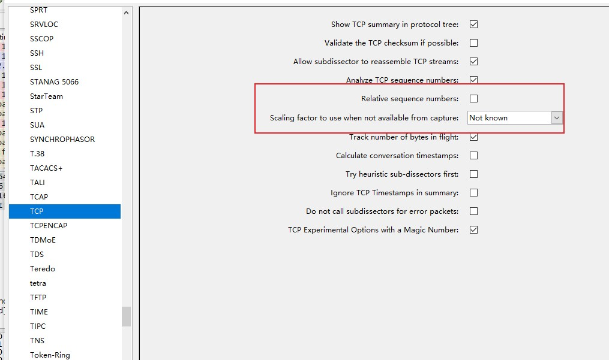

## 解决网络卡顿问题

> 探索如何检测网络缓慢的根源，讨论用基线测试网络以及网络上运行的设备与服务的方法。

#### TCP的错误恢复特性

> TCP的错误恢复特性是定位、诊断，并最终修复网络高延迟的最好工具。在计算机中，‘延迟’，是数据包传输与接收时间差的衡量参数。延迟可测单向延迟或双向延迟。

#### TCP重传

> 重传数据包是TCP最基本的错误恢复特性之一，它被设计利用来对付数据包丢失。数据丢包可能原因有很多，例如：出故障的应用程序、流量负载沉重的路由器.....

> 决定是否有必要重传数据包的主要机制叫做重传计时器，这个计时器负责维护一个叫重传超时(Retransmission timeout,RTO)的值。**每当使用TCP传输一个数据包时，就启动重传计时器，当收到这个数据包的ACK时，计时器停止。从发送数据包到接收到ACK确认之间的时间被称作为往返时间(Round-trip time，RTT)，将若干个这样的时间平均下来，可算出最终的RTO值**

> 在最终算出RTO值之前，传输操作系统将一直依赖于默认配置的RTT，此项设定用于主机间的初始通信，并基于接收到的数据包RTT进行调整，以形成真正的RTO。一旦RTO值确定下来，重传定时器就被用于每个传输的数据包，以确定数据包是否丢失。

> 当数据包被发送出去，但接收方没有发送TCP\ACK数据包时。传输主机就假设原来的数据包丢失，就会重传，并且RTO值会每次翻倍。这个过程会持续到收到一个ACK数据包，或者发送方到配置的最大重传次数为止。Windows下默认为最多重传5次，Linux下默认最多重传15次。这两个选项在两个操作系统中都可以配置。

#### TCP重复确认和快速重传

> 当接收方收到乱序的数据包时，就发送重复的TCP ACK数据包。TCP在头部使用序号、确认号字段，以保证数据被可靠接收并以发送顺序重组。**TCP数据包的准确术语其实应该是TCP分段**。

> 建立新的一个TCP连接时，会建立一个初始序列(Initial Sequence Number,ISN),是握手过程中交换的最重要信息之一，一旦设置好连接两端地ISN，接下来传输地每一个数据包都将按照数据载荷的大小序号。例如：一台主机的ISN是5000，它发送一个500字节的数据包给接收方。一旦接收到此数据包，接收方会根据一下规则响应一个包含确认号5500的TCP ACK数据包。**接收数据的序号+接收数据的字节数=下一个发出的确认号**。序列使数据接收方检测数据包丢失成为可能，当接收方追踪正在接收的序号时，如遇到不合顺序的序号，它就知道数据包丢失。

> 当接收到一个意外的数据包时，为了正确的重组数据，接收方必须得到丢失的数据包，因此它重新发送一个包含丢失数据包的ACK数据包，以便发送方重传该数据包。当传输主机接收到重复ACK时，它假设数据包确实在传输中丢失，并立刻发送一个快速重传。**一旦触发快速重传，其它所有正在传输的数据包都要靠边，直到把快速重传数据包发送出去为止**。

> 注意:默认情况下，Wireshark使用相对序号来简化对这些数字的分析，关闭方法如下：**选择Edit-->Preferences,在Preferences窗口中选择Protocols,然后选着TCP区段。最后取消Relative secuence numbers和windows scalling旁边的复选框**

 

> 当发生数据包丢失时，可能影响TCP通信数据流的功能是选择性的确认(Selective Acknowledgement)当协商开启选择性ACK时，一旦数据包丢失并收到重复ACK，即使在丢失数据包之后还成功接收了其它数据包，也只需要重传丢失的数据包，如果不启用选择性ACK，那就必须重新传输丢失数据包之后的每一个数据包。选择性ACK使得数据丢失的恢复更加高效，由于大部分现代TCP/IP协议栈的实现都支持选择性ACK，因此此功能通常都会被启用。

#### TCP流控制

> TCP实现了滑动窗口，用于检测何时发生了数据包丢失，并调整数据传输速率加以避免，滑动窗口机制利用数据接收方的接收窗口来控制数据流。存储在TCP头部中(以字节为单位)，它告诉发送设备自己希望在TCP缓冲空间存储多少数据。**这个缓冲空间是数据在可以向上传递到等待处理数据的应用层协议之前的临时存储空间**，发送方一次只能发送Windows Size域指定的数据量。为了传输更多的数据，接收方必须发送确认，以告知之前的数据已经收到了。它也必须要处理占用TCP缓冲空间的数据，以清空缓冲区。**接收窗口使得接收方不被数据淹没**。

##### 调整窗口大小

> 当处理事务繁忙时，可以调整窗口大小，实现数据恒定流动，减少数据丢失、损坏的情况。

> 某些情况下，服务端可能无法处理客户端的数据，这可能时因为内存不足、缺少处理能力、其它问题。这可能导致数据包中止、通信过程停止。但接收窗口能够将负面影响最小化。这时，服务端可以发送一个数据包，指明窗口大小为0。当客户端接收到时，会停止传输数据，但仍通过传输‘保活数据包’保持与服务器的连接。客户端周期性地发送保活数据包，以检查服务端接收窗口情况。一旦服务端能再次处理数据，会响应一个非零窗口大小的数据包以恢复通信。

重传数据包：

> 发生重传因为客户端检测到服务器没有接收到它发送地数据，因此，你能否看到重传取决于你在分析通信的哪一端。如果你在服务端没有接收到客户端发送、重传的数据包。那你将被蒙在鼓里，。如果你发现服务端受到了数据包丢失的影响，你应该考虑到在客户端那边捕获流量以观察是否有重传包出现。

重复ACK数据包

> 倾向把重传ACK看作重传的表面对立词(pseudo-opposite),因为当服务器检测到来自客户端的数据包的数据包丢失时就发送它。在多数情况下你可以在两端都看得到重复ACK包，当接收到乱序数据包时才触发重复ACK。

零窗口和保活数据包、

> 滑动窗口与服务器接收、处理数据的故障直接相关。服务器的某些问题可以直接导致窗口大小减少或达到零窗口状态。

##### 高延迟原因

> 有时候，数据包丢失并不是延迟的原因。当两台主机之间通信很慢时，并没有TCP重传或重复ACK特征，就需要采取其它技术来定位。最有效的办法之一就是查看初始连接握手以及接下来的两个数据包。**例如：客户端与Web服务器之间的连接，6个数据包包括TCP握手、HTTP GET请求、GET请求的确认、服务器发往客户端的第一个数据包**

正常通信

> 把时间设置为：**View-->Time Display Format-->Seconds Since Previous Displayed Packet**[相对于上一个数据包的时间]，将会看到Time一列时间非常快速

慢速通信-->线路延迟

> 当看到客户端SYN-->服务端SYN/ACK时间差很大或客户端HTTP GET-->服务端ACK很大时，基本可以标志为线路延迟。因为：发送一个响应只需要非常小的处理量，应该立马发送出去，客户端除了接收响应包也没干啥。此刻可以检查线路之间的防火墙、路由器、等设备的问题。

慢速通信-->客户端延迟

> 当看到第三个握手包与第一个HTTP GET请求时间差很大时，可以标志位客户端问题。因为：它们的共同点都是客户端发送的，ACK应该快速的切换到GET。创建和传输GET数据包确实需要应用层的处理，而处理过程的延迟表明客户端无法及时执行该动作。也就意味着延迟发生在客户端。

慢速通信-->服务器延迟

> 当看到HTTP ACK与第六个数据包之间时间差很大时，可以标志为服务端问题。因为：他们的共同点都是服务器发送的，ACK应该快速切换到发生数据包过程，延迟收到这个数据包表明服务器不能及时处理这个数据，最终延迟的原因指向了服务器。

#### 网络基线

> 网络基线包含来自网络不同端点的流量样本，包括大量我们认可的‘正常’网络流量。网络基线的作用是在网络或设备工作不正常时作为的比较的基准。应该把你的基线中的每一个组件置入这3个基本基线目录中：站点、主机、应用程序

站点基线

> 站点基线的目的是获得网络上每一个物理站点的整体流量快照，理想情况下将是WAN内的每一个网段，包括如下：

+ 使用的协议：在网络边缘(路由器/防火墙)捕获网段上所有设备的流量时，使用协议分层统计图(Statistics-->Protocol Hierarchy)来查看所有设备的流量。然后，你可以对照看看是否缺少本应该出现的协议，或网络出现了新的协议。也可以看高于正常数量的特定类型的流量
+ 广播流量：包含网段上的一切广播流量，在站点内任一点都可以捕获所有广播流量，可以了解正常情况下谁将大量广播流量发送到网络中，这样将会很快确定是否过多/过少出现广播流量。
+ 身份验证序列：包括任意客户端到所有服务的身份验证过程的流量，例如：动态目录、Web应用程序、特定软件等。身份验证通常时服务运行缓慢的一个方面，通过基线可以确认身份验证是否是通信缓慢的原因。
+ 数据传输率：通常包括网络上测量这个站点到其它站点传输的大量数据。可以使用Wireshark的捕获概述和绘图功能确定传输速率和连接的一致性，这可能是最重要的站点基线，每当在网段建立或拆除连接很慢时，可以与基线对比，找出原因。

主机基线

> 使用主机基线并不意味着你必须在网络上测试每台主机。主机基线只需要在高流量或关键任务服务器上执行。基本上，只要某台服务器缓慢会招来管理层电话，就必须在那台主机上建立基线。包括如下：

+ 使用的协议
+ 空闲/繁忙流量：这个基线只是简单包含了高峰和非高峰时段正常操作流量的总体捕获记录。了解到一天之中不同时段的连接数量及其占用带宽大小，有助于你确定缓慢时用户负载还是其他原因造成的。
+ 启动/关闭：需要在主机启动和关闭时创建一个流量捕获记录。一旦计算机不能启动、不能关闭，或这两个过程异常缓慢，你可以使用它确认问题是否跟网络有关
+ 身份验证序列
+ 关联/依赖：这个基线需持续更长时间的捕获，以确认这台主机依赖于哪些主机(以及哪些主机依赖于这台主机)。你可以通过会话窗口(Statistics-->Conversations)查看这些关联和依赖。Web服务器依赖于SQL服务器便是这样的例子。有时我们会意识不到主机间的一些潜在依赖关系，这时主机基线便能派上用场。通过这个，你可以确定主机不能正常运转是因为配置错误，还是因为所依赖主机的高延迟
+ 数据传输率：使用Wireshark的捕获概述和绘图功能确定数据传输率和连接一致性。每当有人报告应用程序缓慢时，你可以使用这个基线来确定当前问题是否是高利用率或用户负载造成的

基线创建的注意项

+ 创建每个基线都至少要经过3次：低流量期间(早晨)、高流量期间(下午3点左右)、无流量期间(深夜)
+ 有可能的话，尽量避免直接在需要创建基线的主机上捕获流量。因为在高流量期间，这可能会增加设备负载、影响性能，并可能因数据包丢失导致基线无效
+ 你的基线可能包含一些与网络有关的私密信息，一定要加密保存好
+ 让所有的.pcap文件与你的基线关联，为更常见的参考值写一份‘小抄’，例如：关联关系或数据传输率